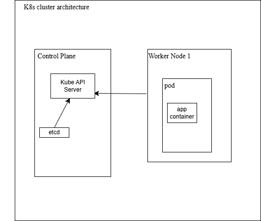

# Kubernetes Security Implementation

This repository contains Kubernetes configuration files that implement key security measures in a cluster, including Role-Based Access Control (RBAC), isolated environments, limiting pod-to-pod communication.

## Files Overview

### 1. `rbac.yaml`

- Ensures that the go-app-sa service account has controlled access to pods within its namespace, following the principle of least privilege

### 2. `namespace.yaml`

- Creates a new namespace named go-app to isolate and manage resources related to an application.
- Defines a ServiceAccount named go-app-sa within the go-app namespace, providing an identity for Pods in that namespace to securely access the Kubernetes API and other resources

### 3. `network-policy.yaml`

- Creates a NetworkPolicy named restrict-pod-communication in the go-app namespace.
- It restricts incoming traffic to Pods labeled app: go-http-server, allowing only other Pods with the same label to communicate with them.

# CI/CD Pipeline 

The CI/CD pipeline consists of several 3 jobs, each performing specific functions:

### 1. Build Job

- **Code Checkout**: Uses `actions/checkout@v3` to check out the latest code from the repository.
- **Set Up Go Environment**: Uses `actions/setup-go@v3` to install Go version 1.20.
- **Run GoLint**: Executes the lint checks
- **Run GO Tests**: Executes go tests
- **Validate Kubernetes Manifests**: Uses `instrumenta/kubeval-action@master` to validate Kubernetes manifest files located in the `k8s` directory. This checks for syntactical correctness and ensures they adhere to Kubernetes specifications.

### 2. Docker Job

- **Code Checkout**: Checks out the code again to ensure the latest changes are included.
- **Log in to Docker Hub**: Uses `docker/login-action@v1` to authenticate to Docker Hub using stored secrets. This allows the pipeline to push the Docker image securely.
- **Build Docker Image**: Builds the Docker image for the Go HTTP server using the Dockerfile in the root of the repository.
- **Scan Docker Image for Vulnerabilities**: Runs Trivy in a Docker container to scan the built image for high and critical vulnerabilities, ensuring only secure images are deployed.
- **Push Docker Image**: Pushes the built Docker image (`jaycynth/go-http-server:v0.1`) to Docker Hub, making it available for deployment.

### 3. Deploy Job

- **Code Checkout**: Checks out the code again in preparation for deployment.
- **Install Kind**: Installs Kind (Kubernetes in Docker), which allows the creation of a local Kubernetes cluster for testing and deployment.
- **Create Kubernetes Cluster**: Uses Kind to create a local Kubernetes cluster.
- **Check Kubernetes Cluster Status**: Runs `kubectl cluster-info dump` to retrieve and display information about the cluster's status.
- **Deploy to Kubernetes**: Applies the Kubernetes manifests to deploy the application. This includes:
  - **Namespace**: Defines the namespace for isolating resources.
  - **RBAC**: Configures Role-Based Access Control to manage permissions securely.
  - **Network Policy**: Enforces policies to restrict pod-to-pod communication as required.
  - **Deployment**: Deploys the Go HTTP server application to the Kubernetes cluster.

## Cluster Design

